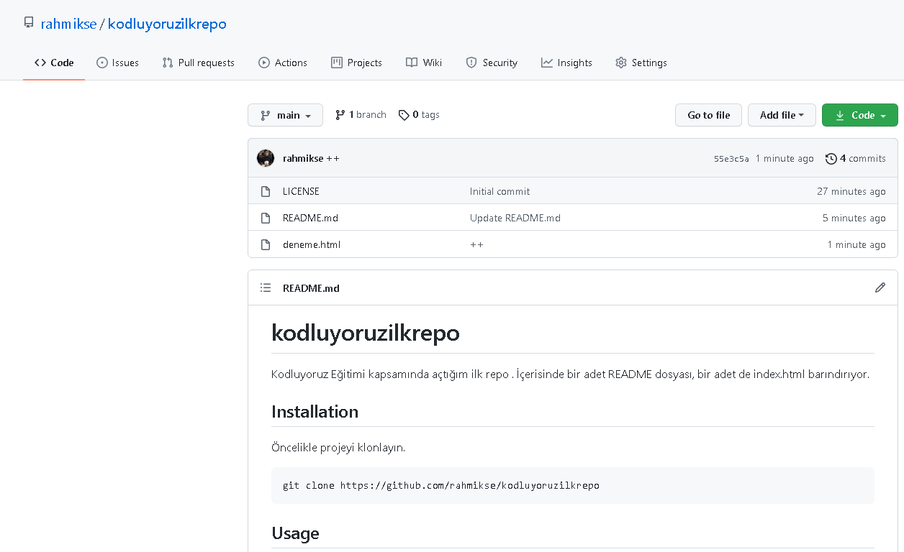

# kodluyoruzilkrepo
Kodluyoruz Eğitimi kapsamında açtığım ilk repo . İçerisinde bir adet README dosyası, bir adet de index.html barındırıyor.Eklemeler günden güne yapılıp commit atılacaktır.



## Installation

Öncelikle projeyi klonlayın.

```
git clone https://github.com/rahmikse/kodluyoruzilkrepo
```

## Usage

Projeyi cloneladıktan sonra Visual Studio Code programında açınız.

Linux için: 

```
cs kodluyoruzilkrepo
code .
```

## Contributing

Pull requestler kabul edilir. Büyük değişiklikler için lütfen önce neyi değiştirmek istediğinizi tartışmmak için bir konu açınız.

## License 

[MIT](https://choosealicense.com/licenses/mit/)
